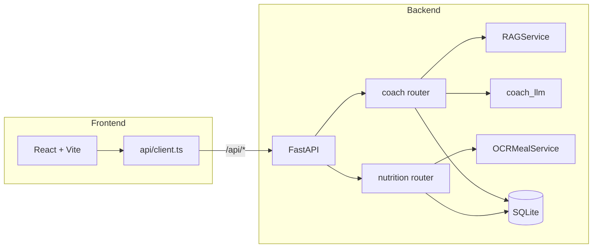

# Flex Fitness — Step-by-step improvement plan

This plan is based on a full pass over [backend/app/](backend/app/), [frontend/src/](frontend/src/), Docker setup, and config. Improvements are grouped by area with concrete steps.

---

## 1. Security and configuration

**1.1 Keep secrets out of the repo**

- Ensure [.env](.env) is never committed (it is in [.gitignore](.gitignore); double-check no real keys are in history).
- Add a `.env.example` with placeholder values (`GEMINI_API_KEY=`, `OPENAI_API_KEY=`, etc.) and document required vars in [README.md](README.md).

**1.2 Harden CORS and env-based config**

- In [backend/app/main.py](backend/app/main.py), CORS `allow_origins` is fixed to `http://localhost:5173` and `http://127.0.0.1:5173`. Add a configurable list (e.g. `CORS_ORIGINS` in [backend/app/config.py](backend/app/config.py)) so production frontend URL can be set via env; default to current list for dev.

**1.3 Optional: authentication**

- Today there is no auth; any caller can hit all endpoints. For a multi-tenant or production deployment, add a simple auth layer (e.g. API key header, or JWT after login) and protect `/api/`*. Document in README that the current setup is for local/trusted use.

---

## 2. API completeness and data integrity

**2.1 Client update and delete**

- Only create and read clients exist. Add:
  - `PATCH /api/nutrition/clients/{id}` — update client (reuse [ClientProfileCreate](backend/app/schemas.py) or a partial schema).
  - `DELETE /api/nutrition/clients/{id}` — delete client (define cascade or restrict: e.g. block if meal logs exist, or soft-delete).
- Add corresponding functions in [frontend/src/api/client.ts](frontend/src/api/client.ts) and minimal UI (e.g. “Edit” on Dashboard client list, or a settings page).

**2.2 Fix and use SupplementLog / RecoveryLog**

- In [backend/app/db/models.py](backend/app/db/models.py), `SupplementLog` and `RecoveryLog` use `client_id: Mapped[int]` without `ForeignKey("client_profiles.id")`, unlike `MealLog`/`MealPlan`. Add the FK and optional `relationship` for consistency and referential integrity.
- Add migrations (e.g. Alembic) so schema changes are versioned; until then, document that DB reset may be needed after model changes.

**2.3 Meal plan, supplements, recovery: persist optional**

- Coach endpoints return RAG/LLM output but do not persist meal plans, supplement suggestions, or recovery protocols. Optionally add:
  - POST to save a generated meal plan into `MealPlan` (already modeled); or “Save this plan” from frontend that calls a new endpoint.
  - Similar “log” endpoints for supplements/recovery that write to `SupplementLog`/`RecoveryLog`, so users can track what was suggested and what they did.

---

## 3. RAG and ingest robustness

**3.1 RAG ingest: avoid full overwrite and document behavior**

- In [backend/app/services/rag.py](backend/app/services/rag.py), `ingest_documents` uses `Chroma.from_documents(...)`, which can create a new collection or replace existing content depending on Chroma version. Document current behavior in README (e.g. “Re-running ingest replaces the vector store for the collection”). If the goal is incremental ingest, consider: delete collection by name then re-add, or use Chroma’s `add_documents` with a stable collection so re-ingest is predictable (e.g. “clear + re-add” or “append only”).
- Add a simple check: if `docs_dir` is empty or no `.txt`/`.md` files, return 0 and optionally log; avoid creating an empty collection that might overwrite a good one.

**3.2 Ingest: include .md in loader**

- The first loader only loads `**/*.txt`; the second loads `**/*.md`. Both are used and extended into `raw`. No bug, but ensure the directory passed to ingest is the same as in [backend/app/api/coach.py](backend/app/api/coach.py) (`backend/data/docs`). Document that both `.txt` and `.md` are ingested.

**3.3 Error handling and timeouts for LLM/vision**

- In [backend/app/services/coach_llm.py](backend/app/services/coach_llm.py) and [backend/app/services/ocr_meal.py](backend/app/services/ocr_meal.py), LLM/Gemini calls can hang or fail. Add timeouts (e.g. 30–60s) and catch exceptions; return a clear message to the client (“Coach temporarily unavailable” / “Image analysis failed”) instead of exposing stack traces. Consider a retry with backoff for transient failures.

---

## 4. Backend validation and file uploads

**4.1 Request validation**

- Add Pydantic validators where useful: e.g. `client_id` > 0, `days` in 1–14 for meal plan, `meal_type` in `["breakfast","lunch","dinner","snack"]`, message length limits for chat.
- In [backend/app/api/nutrition.py](backend/app/api/nutrition.py), for `log_meal_image`: limit file size (e.g. max 10 MB) and validate content type (image/jpeg, image/png, etc.) before passing bytes to OCR; reject with 400 and a clear message if invalid.

**4.2 Centralized dependency for DB session**

- `get_db()` is defined in both [backend/app/api/coach.py](backend/app/api/coach.py) and [backend/app/api/nutrition.py](backend/app/api/nutrition.py). Move it to a common module (e.g. `app/deps.py` or `app/db/session.py`) and reuse in both routers to avoid duplication.

---

## 5. Testing

**5.1 Backend tests**

- There are no tests today. Add a test suite (e.g. pytest with `httpx.ASGITransport` for FastAPI) and cover:
  - Health or root endpoint.
  - Create client → list clients → get client.
  - Log meal (manual) → list meals.
  - Coach ingest (mock or real docs dir) and optionally a simple chat test with mocked LLM.
- Run tests in CI (e.g. GitHub Actions) and in [Dockerfile.backend](Dockerfile.backend) if desired (e.g. optional test stage).

**5.2 Frontend tests (optional)**

- Add a test runner (e.g. Vitest) and at least smoke tests for critical flows (e.g. Dashboard loads, client list renders, Coach chat form submits). This improves confidence when changing API or UI.

---

## 6. Frontend improvements

**6.1 API base URL and error handling**

- In [frontend/src/api/client.ts](frontend/src/api/client.ts), `API = "/api"` is correct for dev proxy and Docker. For production, consider `import.meta.env.VITE_API_URL || "/api"` so the same build can talk to a different backend if needed.
- Improve error handling: parse `r.json()` on 4xx/5xx when the backend returns a JSON body (e.g. `{"detail": "..."}`), and surface that message instead of a generic “Failed to …”.

**6.2 Loading and empty states**

- Pages already use loading flags; ensure every async path sets loading false in `finally` and that errors are shown (e.g. toast or inline message) instead of only `console.error`. Add a simple “No clients” / “Select a client” empty state where it improves UX.

**6.3 Dependencies and build**

- [frontend/package.json](frontend/package.json) uses Vite 2 and React 18. Consider upgrading to a current Vite 5 (and related deps) for better performance and tooling; do this in a separate step and run full build + manual smoke test.
- Add a `package-lock.json` (or lockfile) and use `npm ci` in Docker for reproducible builds (Dockerfile.frontend already uses `npm ci` when lockfile exists).

---

## 7. Operations and observability

**7.1 Health check**

- Add a `GET /health` (or `/api/health`) that returns 200 and optionally checks DB connectivity and Chroma availability. Use it in Docker `HEALTHCHECK` and in any orchestrator.

**7.2 Logging**

- Use structured logging (e.g. Python `logging` with JSON or consistent format). Log request IDs, client_id where relevant, and errors (with traceback server-side only). Avoid logging request bodies that may contain PII (e.g. chat messages) at DEBUG in production.

**7.3 Docker and entrypoint**

- [Dockerfile.backend](Dockerfile.backend) references `COPY backend/docker-entrypoint.sh`; ensure this script exists and creates `data`/volumes as needed. If not present, add a minimal entrypoint that prepares dirs and then exec’s uvicorn.
- In [docker-compose.yml](docker-compose.yml), consider adding a `healthcheck` for the backend so the frontend (or a reverse proxy) can depend on a healthy API.

---

## 8. Suggested order of implementation

| Priority | Area       | Steps                                                                     |
| -------- | ---------- | ------------------------------------------------------------------------- |
| High     | Security   | 1.1 (.env.example, no secrets), 1.2 (CORS from config)                    |
| High     | API        | 2.2 (FKs + migrations), 2.1 (client PATCH/DELETE), 4.2 (shared get_db)    |
| Medium   | Robustness | 4.1 (validation, file size/type), 3.3 (LLM timeouts/errors), 7.1 (health) |
| Medium   | RAG        | 3.1 (ingest behavior doc + empty-dir check), 3.2 (doc .md in README)      |
| Lower    | Features   | 2.3 (persist meal plan / supplement / recovery logs)                      |
| Lower    | Frontend   | 6.1 (error messages), 6.2 (error/empty UX), 6.3 (Vite upgrade)            |
| Lower    | Ops        | 7.2 (logging), 7.3 (entrypoint/healthcheck in Docker)                     |
| Optional | Auth       | 1.3 (API key or JWT)                                                      |
| Optional | Testing    | 5.1 (backend tests), 5.2 (frontend tests)                                 |

---

## Architecture (current, high-level)

Implementing the items above in the suggested order will improve security, maintainability, and production-readiness without changing the core product behavior.